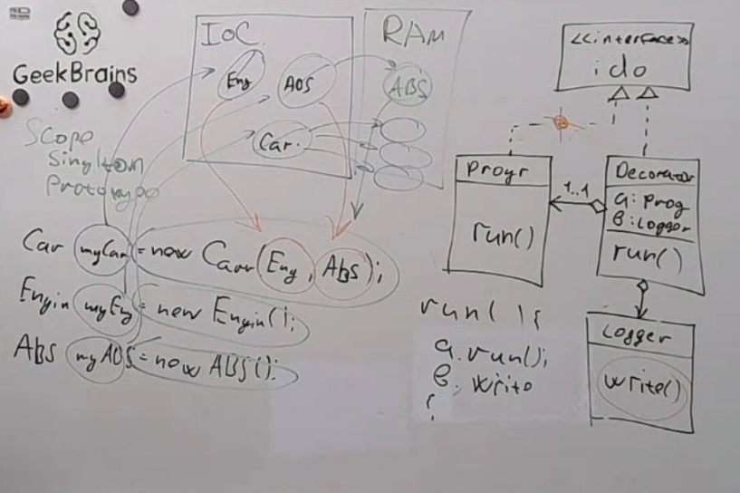
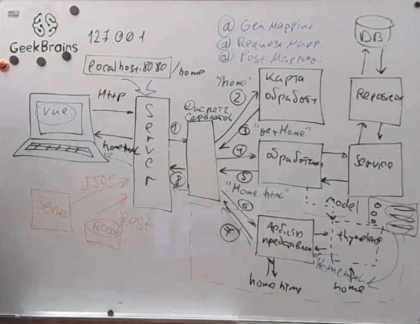
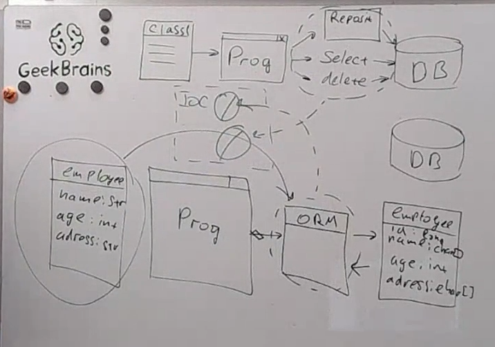
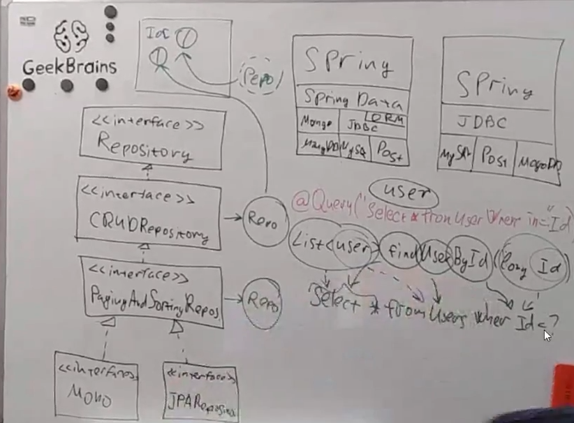
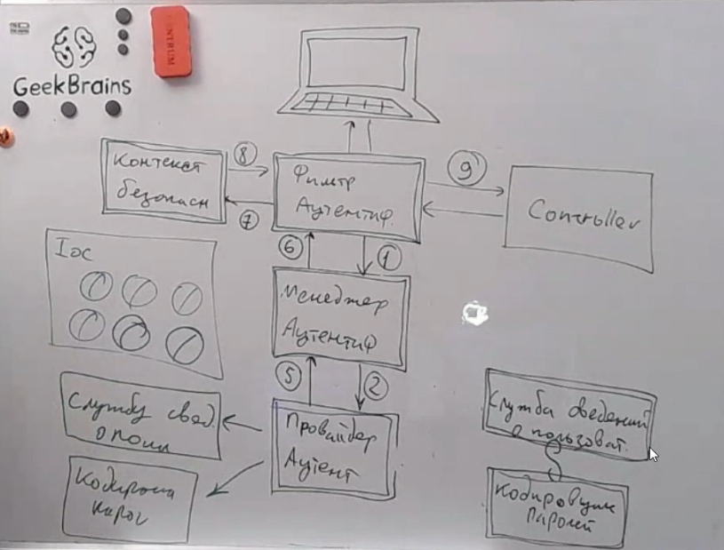

## Описание

`Общее`


Принцип в том что Spring сам инициализирует объекты добавленные в контейнер.

Несколько видов инициализации Scope (зона видимости Bean)

[Singleton, Prototype, | Session, Request, ...]

`Когда spring запускается он сначала все сканирует (метки) но пока ничего не создает.`

HibernateConfiguration про BeanDefinition -> BeanFactory -> Bean

| Параметр                            | Описание                                                                           |
|-------------------------------------|------------------------------------------------------------------------------------|
| Inversion of control(IoC) container | Библиотека создания прототипов                                                     |
| Dependency Injection                | Технология автоматической подстановки при создании объекта                         |
| Bean                                | Объект, жизненным циклом которого управляет Spring. (Все объекты созданные Spring) |
| ApplicationContext                  | контейнер для Bean                                                                 |
                                                                            |

| Аннотация      | Описание                                                                                                                                         |
|----------------|--------------------------------------------------------------------------------------------------------------------------------------------------|
| @Component     | [EmailSender.java](Lesson_2_Base%2Fsrc%2Fmain%2Fjava%2Fru%2Fgb%2FLesson2_basics%2FS2%2Fcore%2FEmailSender.java)                                  |
| @Autowired     | [EmailSender.java](Lesson_2_Base%2Fsrc%2Fmain%2Fjava%2Fru%2Fgb%2FLesson2_basics%2FS2%2Fcore%2FEmailSender.java)                                  |
| @Bean          | [HibernateConfiguration.java](Lesson_2_Base%2Fsrc%2Fmain%2Fjava%2Fru%2Fgb%2FLesson2_basics%2FS2%2Fconfiguration%2FHibernateConfiguration.java)   |
| BeanDefinition | [HibernateConfiguration.java](Lesson_2_Base%2Fsrc%2Fmain%2Fjava%2Fru%2Fgb%2FLesson2_basics%2FS2%2Fconfiguration%2FHibernateConfiguration.java)   |
| @Primary       | [HibernateConfiguration.java](Lesson_2_Base%2Fsrc%2Fmain%2Fjava%2Fru%2Fgb%2FLesson2_basics%2FS2%2Fconfiguration%2FHibernateConfiguration.java)   |
| @Qualifier     | [HibernateSessionFactory.java](Lesson_2_Base%2Fsrc%2Fmain%2Fjava%2Fru%2Fgb%2FLesson2_basics%2FS2%2Fconfiguration%2FHibernateSessionFactory.java) |
| @Scope         | [Application.java](Lesson_2_Base%2Fsrc%2Fmain%2Fjava%2Fru%2Fgb%2FLesson2_basics%2FS2%2FApplication.java)                                         |
| @PostConstruct | [Application.java](Lesson_2_Base%2Fsrc%2Fmain%2Fjava%2Fru%2Fgb%2FLesson2_basics%2FS2%2FApplication.java)                                         |
| @PreDestroy    | [Application.java](Lesson_2_Base%2Fsrc%2Fmain%2Fjava%2Fru%2Fgb%2FLesson2_basics%2FS2%2FApplication.java)                                         |
| SINGLETON      | [Singleton.java](Lesson_2_Base%2Fsrc%2Fmain%2Fjava%2Fru%2Fgb%2FLesson2_basics%2FS2%2Fscope%2FSingleton.java)                                     |
| PROTOTYPE      | [Prototype.java](Lesson_2_Base%2Fsrc%2Fmain%2Fjava%2Fru%2Fgb%2FLesson2_basics%2FS2%2Fscope%2FPrototype.java)                                     |

Жизненный цикл Bean

#### Жизненный цикл Bean

    - @PostConstruct
      public void init()
      вызывается в самом начале когда bean создается
    - @PreDestroy
      public void destroy()
      вызывается в самом конце когда, например закрывается контекст contest.close()

В целом когда контекст открывается Spring ищет у бинов @PostConstruct а при закрытии @PreDestroy

- bean1, bean2, bean3(prototype), ...
- каждый раз когда мы делаем getBean это по сути тоже что map.get("emailSender") достаем по сути
  AppContext[bean1, bean2, bean3(prototype)] HashMap<String, Object>
- ...
- context.close()
- -> bean1.preDestroy()
- когда вызывается @PreDestroy у нас не уничтожается объект (он в хипе/оперативке)
  уничтожится просто bean из контекста (из HashMap)
  Spring работает с Java а не напрямую с оперативкой

### Архитектура "MVC"



Сначала запрос http URI поступает на сервер `localhost:8080/home`

1. Server отправляет URN `/home` на диспетчер сервлетов.
    - Servlet - это когда на одного клиента выделяется 1 поток на 1 http соединение
2. диспетчер сервлетов спрашивает какому обработчику отправить подобный запрос `/home`
    - Карта обработчиков содержит в себе всех обработчиков которые занимаются ответом на приходящие сервлеты
3. карта обработчиков отвечает адресом того обработчика на который может быть перенаправлен http вызов
4. Контролер запускает обработку запроса, параллельно передавая модель в арбитр представлений
5. Возвращает результат
6. После обработки запроса результат попадает на арбитр представлений
7. Арбитр представлений возвращает html файл заполненный согласно того как его заполнил контролер
8. Возвращенное представление передается обратно на сервер.
   Сервер возвращает отображение клиенту

- Для того чтобы попасть в контроллер нужна аннотация @Controller
- Чтобы попасть в Карту обработчиков нужны @<GET,Post,Request>mapping
- Арбитр представлений статический он просто ищет шаблоны в папках static и template

###### Разница между @Controller @RestController в rest нет арбитра представлений и он сразу вернет серверу результат на 5 пункте

### Архитектура "Слой за слоем"

model, service, repository и controller
[timesheet](Lesson_3_timesheet%2Fsrc%2Fmain%2Fjava%2Fru%2Fgb%2Ftimesheet)

### REST

[REST.java](Lesson_3_timesheet%2Fsrc%2Fmain%2Fjava%2Fru%2Fgb%2Ftimesheet%2FREST.java)

| Annotation                                | Description                                                                                                                                                                                                                       |
|-------------------------------------------|-----------------------------------------------------------------------------------------------------------------------------------------------------------------------------------------------------------------------------------|
| @RestController                           | Указывает, что данный класс является контроллером, и позволяет обрабатывать HTTP-запросы. Эта аннотация сочетает в себе @Controller и @ResponseBody, что означает, что методы класса будут возвращать данные прямо в тело ответа. |
| @RequestMapping("/get")                   | Используется для задания URL, по которому будет доступен контроллер или его методы. Может быть применена как к классу, так и к отдельным методам.                                                                                 |
| @GetMapping, @PostMapping, @DeleteMapping | Эти аннотации являются специализированными версиями @RequestMapping и используются для указания типа HTTP-запроса (GET, POST, DELETE), который должен обрабатывать метод.                                                         |
| @PathVariable                             | Аннотация используется для извлечения значений из URI. Например, значение переменной id будет извлечено из части URI и передано в метод.                                                                                          |
| @RequestBody                              | Аннотация используется для привязки HTTP-запроса к объекту в методе контроллера. Например, JSON-запрос будет преобразован в объект                                                                                                |
| @ResponseEntity                           | Класс используется для представления всего HTTP-ответа. Это позволяет контролировать все аспекты ответа, такие как код состояния, заголовки и тело.                                                                               |
| @Repository                               | Аннотация используется для обозначения класса, который будет взаимодействовать с базой данных. Она указывает Spring, что этот класс должен быть зарегистрирован как компонент управления данными (DAO).                           |
| @Service                                  | Аннотация используется для обозначения сервисного слоя. Сервисные классы содержат бизнес-логику приложения.                                                                                                                       |

### application.properties

```properties
# переопределение сервера 
server.port=9090
# должен ли Spring JPA автоматически генерировать команды (например, создание таблиц) на основе ваших сущностей.
# false: Spring JPA не будет генерировать DDL команды автоматически. Вы должны сами управлять схемой базы данных (например, с помощью SQL скриптов или инструментов миграции, таких как Flyway или Liquibase).
spring.jpa.generate-ddl=false
#Hibernate не будет выполнять никаких операций с базой данных (ни создания, ни обновления, ни проверки схемы) при запуске приложения
spring.jpa.hibernate.ddl-auto=none
```

### application.yml

```yml
server:
  port: 9090
spring:
  application:
    name: "project"
  datasource:
    # url: jdbc:postgresql://localhost:5432/timesheets_db
    url: jdbc:h2:mem:test
    username: sa
    password:
    driver-class-name: org.h2.Driver
  jpa:
    generate-ddl: false
    hibernate:
      ddl-auto: none
```

### SpringData

Брокер


Чтобы использовать нужный нам репощиторий нужно просто его унаследовать
Spring сам составляет запросы по названию метода, Если не получится, выдаст ошибку


```java
/**
 * Интерфейс по которому собирается автоматически генерируемая SpringData <объект,ключ>
 */
public interface AccountRepository extends CrudRepository<Account, Long> {
    @Query("SELECT * FROM account WHERE name = :name")
    List<Account> findAccountsByName(String name);

    @Modifying
    @Query("UPDATE account SET amount = :amount WHERE id = :id")
    void changeAmount(long id, BigDecimal amount);
}
```

| Annotation     | Description                                                             |
|----------------|-------------------------------------------------------------------------|
| @Modifying     | Чтобы спринг дат ане пыталась формировать запрос, мы его переопределяем |
| @Query         | Запрос вручную прописанный                                              |
| @Transactional | Описывает атрибут транзакции в отдельном методе или в классе            |
|                |                                                                         |

### lombok

| Annotation                 | Description                                                          |
|----------------------------|----------------------------------------------------------------------|
| @Data                      | Все аннотации                                                        |
| @AllArgsConstructor        | Все параметры конструктор                                            |
| @ToString                  | -                                                                    |
| @Id                        | Внешний ключ                                                         |
| @EqualsAndHashCode.Include | указания, какие поля должны быть включены в методы equals и hashCode |

### JPA

| Annotation                                          | Description                          |
|-----------------------------------------------------|--------------------------------------|
| @Entity                                             | чтобы домен начал сохранять его в бд |
| @Id                                                 | Первичный ключ                       |
| @GeneratedValue(strategy = GenerationType.IDENTITY) | Автоматически назначить ключ         |
| @Column(nullable = false)                           | Колонка допустимо занчение null      |
| @Column(name = "new_name")                          | Конкретное имя для колонки           |
|                                                     |                                      |

### Spring Security

