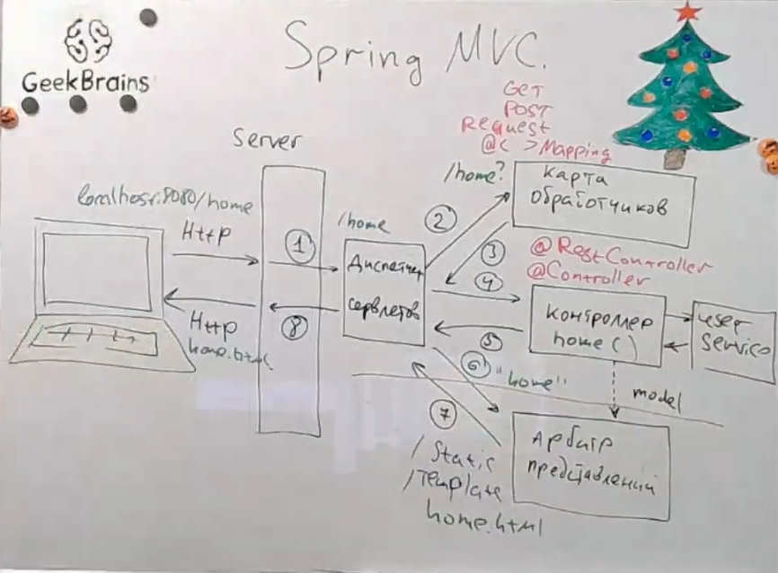

## Описание

`Общее`
[Application.java](Lesson_2_Base%2Fsrc%2Fmain%2Fjava%2Fru%2Fgb%2FLesson2_basics%2FS
2%2FApplication.java)

`@Component`
`@Autowired`
[EmailSender.java](Lesson_2_Base%2Fsrc%2Fmain%2Fjava%2Fru%2Fgb%2FLesson2_basics%2FS2%2Fcore%2FEmailSender.java)

`@Bean` `BeanDefinition` `@Primary` || `arg()`
[HibernateConfiguration.java](Lesson_2_Base%2Fsrc%2Fmain%2Fjava%2Fru%2Fgb%2FLesson2_basics%2FS2%2Fconfiguration%2FHibernateConfiguration.java)

`@Qualifier`
[HibernateSessionFactory.java](Lesson_2_Base%2Fsrc%2Fmain%2Fjava%2Fru%2Fgb%2FLesson2_basics%2FS2%2Fconfiguration%2FHibernateSessionFactory.java)

`@Scope`
[Application.java](Lesson_2_Base%2Fsrc%2Fmain%2Fjava%2Fru%2Fgb%2FLesson2_basics%2FS2%2FApplication.java)

- SINGLETON [Singleton.java](Lesson_2_Base%2Fsrc%2Fmain%2Fjava%2Fru%2Fgb%2FLesson2_basics%2FS2%2Fscope%2FSingleton.java)
- PROTOTYPE [Prototype.java](Lesson_2_Base%2Fsrc%2Fmain%2Fjava%2Fru%2Fgb%2FLesson2_basics%2FS2%2Fscope%2FPrototype.java)

Жизненный цикл Bean
`@PostConstruct` `@PreDestroy`
[Application.java](Lesson_2_Base%2Fsrc%2Fmain%2Fjava%2Fru%2Fgb%2FLesson2_basics%2FS2%2FApplication.java)

### Архитектура "MVC"



Сначала запрос http URI поступает на сервер `localhost:8080/home`

1. Server отправляет URN `/home` на диспетчер сервлетов.
    - Servlet - это когда на одного клиента выделяется 1 поток на 1 http соединение
2. диспетчер сервлетов спрашивает какому обработчику отправить подобный запрос `/home`
    - Карта обработчиков содержит в себе всех обработчиков которые занимаются ответом на приходящие сервлеты
3. карта обработчиков отвечает адресом того обработчика на который может быть перенаправлен http вызов
4. Контролер запускает обработку запроса, параллельно передавая модель в арбитр представлений
5. Возвращает результат
6. После обработки запроса результат попадает на арбитр представлений
7. Арбитр представлений возвращает html файл заполненный согласно того как его заполнил контролер
8. Возвращенное представление передается обратно на сервер.
Сервер возвращает отображение клиенту

- Для того чтобы попасть в контроллер нужна аннотация @Controller
- Чтобы попасть в Карту обработчиков нужны @<GET,Post,Request>mapping
- Арбитр представлений статический он просто ищет шаблоны в папках static и template

###### Разница между @Controller @RestController в rest нет арбитра представлений и он сразу вернет серверу результат на 5 пункте 


### Архитектура "Слой за слоем"

model, service, repository и controller
[timesheet](Lesson_3_timesheet%2Fsrc%2Fmain%2Fjava%2Fru%2Fgb%2Ftimesheet)

### REST

[REST.java](Lesson_3_timesheet%2Fsrc%2Fmain%2Fjava%2Fru%2Fgb%2Ftimesheet%2FREST.java)

| Annotation                                | Description                                                                                                                                                                                                                       |
|-------------------------------------------|-----------------------------------------------------------------------------------------------------------------------------------------------------------------------------------------------------------------------------------|
| @RestController                           | Указывает, что данный класс является контроллером, и позволяет обрабатывать HTTP-запросы. Эта аннотация сочетает в себе @Controller и @ResponseBody, что означает, что методы класса будут возвращать данные прямо в тело ответа. |
| @RequestMapping                           | Используется для задания URL, по которому будет доступен контроллер или его методы. Может быть применена как к классу, так и к отдельным методам.                                                                                 |
| @GetMapping, @PostMapping, @DeleteMapping | Эти аннотации являются специализированными версиями @RequestMapping и используются для указания типа HTTP-запроса (GET, POST, DELETE), который должен обрабатывать метод.                                                         |
| @PathVariable                             | Аннотация используется для извлечения значений из URI. Например, значение переменной id будет извлечено из части URI и передано в метод.                                                                                          |
| @RequestBody                              | Аннотация используется для привязки HTTP-запроса к объекту в методе контроллера. Например, JSON-запрос будет преобразован в объект                                                                                                |
| @ResponseEntity                           | Класс используется для представления всего HTTP-ответа. Это позволяет контролировать все аспекты ответа, такие как код состояния, заголовки и тело.                                                                               |
| @Repository                               | Аннотация используется для обозначения класса, который будет взаимодействовать с базой данных. Она указывает Spring, что этот класс должен быть зарегистрирован как компонент управления данными (DAO).                           |
| @Service                                  | Аннотация используется для обозначения сервисного слоя. Сервисные классы содержат бизнес-логику приложения.                                                                                                                       |

### application.properties

```properties
#переопределение сервера 
server.port=9090
```

### application.yml

```yml
#переопределение сервера 
server:
  port: 9090
```


